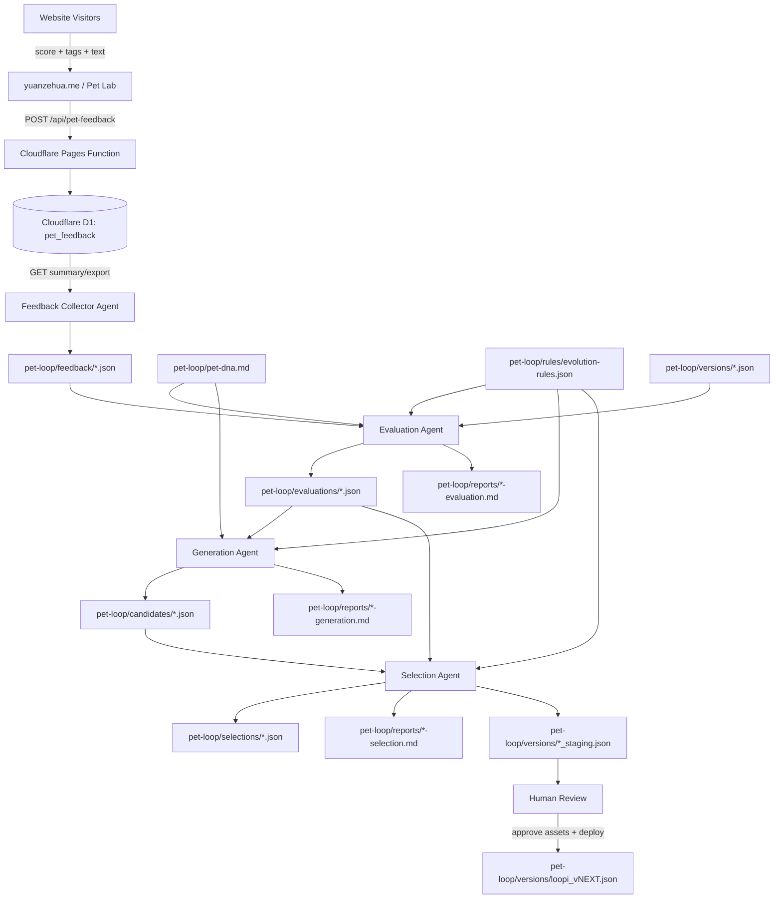
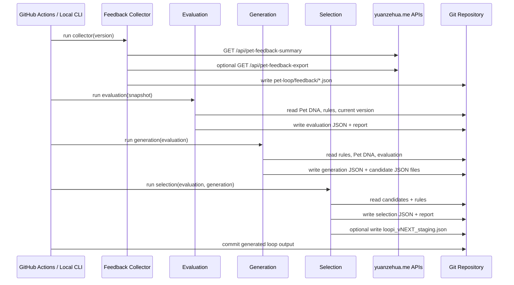
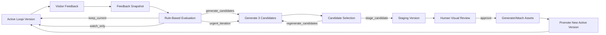

# Homepage Pet Evolution System Multi-Agent Architecture

本文档梳理当前 `Homepage Pet Evolution System` 的 multi-agent 架构。系统目标不是做一个单次生成的宠物形象，而是让部署在 `yuanzehua.me` 上的 Loopi 通过真实访客反馈、规则评估、候选生成和选择机制持续迭代。

当前系统采用 **file-based multi-agent loop**：Agent 的输入、输出、规则、Prompt 和报告都保存在 Git 仓库中；线上反馈保存在 Cloudflare D1；定时调度由 GitHub Actions 触发。

## 设计原则

- **最低数据库复杂度**：线上数据库只保存反馈数据，版本、候选、报告和规则全部放在 Git 仓库。
- **Agent 可审计**：每个 Agent 的输入、输出、规则和报告都有文件记录。
- **不自动发布生产版本**：Selection Agent 只能生成 staging 建议，不会自动替换首页宠物资产。
- **小步迭代**：每轮候选最多改 1-2 个视觉变量，方便判断反馈变化来自哪里。
- **人类最终把关**：视觉资产、spritesheet 动画、首页替换都需要人工确认。

## 总体架构



## Agent 编排方式

总控脚本是：

```bash
node scripts/run-pet-evolution-loop.js loopi_v0_3
```

它按固定顺序调用四个 Agent：

```text
Feedback Collector -> Evaluation -> Generation -> Selection
```

对应实现：

| Agent | 脚本 | Prompt 文件 | 主要输出 |
| --- | --- | --- | --- |
| Feedback Collector | `scripts/run-pet-feedback-collector.js` | `pet-loop/prompts/feedback-collector-agent.md` | `pet-loop/feedback/*.json` |
| Evaluation | `scripts/run-pet-evaluation.js` | `pet-loop/prompts/evaluation-agent.md` | `pet-loop/evaluations/*.json`, `pet-loop/reports/*-evaluation.md` |
| Generation | `scripts/run-pet-generation.js` | `pet-loop/prompts/generation-agent.md` | `pet-loop/generations/*.json`, `pet-loop/candidates/*.json` |
| Selection | `scripts/run-pet-selection.js` | `pet-loop/prompts/selection-agent.md` | `pet-loop/selections/*.json`, `pet-loop/versions/*_staging.json` |

共享工具模块：

- `scripts/pet-loop-core.js`
- 提供版本名清洗、日期、JSON 读写、评分定义、远程 API fetch、文本脱敏等基础函数。

## Agent 1: Feedback Collector Agent

### 功能

Feedback Collector Agent 负责从线上反馈 API 拉取当前 Loopi 版本的反馈统计，并生成一个可提交到 Git 的安全快照。

它是整个 Loop 的数据入口。

### 输入

- 当前版本名，默认来自 `pet-loop/rules/evolution-rules.json` 的 `default_version`。
- 公开统计接口：
  - `/api/pet-feedback-summary?version=<version>`
- 可选管理员导出接口：
  - `/api/pet-feedback-export?version=<version>`
- 环境变量：
  - `PET_SITE_URL`
  - `PET_ADMIN_TOKEN`
  - `PET_LOOP_INCLUDE_REDACTED_TEXT`

### 输出

写入：

```text
pet-loop/feedback/YYYY-MM-DD-loopi_vX_Y-feedback.json
```

核心字段：

- `version_name`
- `collected_at`
- `public_summary.feedback_count`
- `public_summary.average_score`
- `public_summary.question_scores`
- `public_summary.dimension_scores`
- `raw_feedback_available`
- `raw_feedback_count`
- `confidence`

### 对应工具

- Cloudflare Pages Functions:
  - `functions/api/pet-feedback-summary.js`
  - `functions/api/pet-feedback-export.js`
- Cloudflare D1:
  - `pet_feedback` 表
- Node.js:
  - `fetch`
  - `fs`

### 安全策略

- 默认不保存原始评论。
- 默认不保存访客 hash、邮箱、手机号或 IP。
- 只有设置 `PET_LOOP_INCLUDE_REDACTED_TEXT=1` 时，才保存短文本脱敏样本。
- 如果没有 `PET_ADMIN_TOKEN`，系统仍然可以基于公开聚合统计运行。

## Agent 2: Evaluation Agent

### 功能

Evaluation Agent 负责判断当前版本是否应该继续观察、保持不动、生成候选，或进入紧急迭代。

它是 Loop 的判断层。

### 输入

- `pet-loop/feedback/*.json`
- `pet-loop/pet-dna.md`
- `pet-loop/rules/evolution-rules.json`
- `pet-loop/versions/<version>.json`

### 评分模型

当前反馈问卷是 `loopi_homepage_feedback_v1`，包含 8 个问题：

| Key | 含义 | 维度 |
| --- | --- | --- |
| `q1_visual_beauty` | 整体好看 | 视觉第一印象 |
| `q2_visual_quality_professional` | 专业质感 | 视觉第一印象 |
| `q3_homepage_not_abrupt` | 首页不突兀 | 主页适配度 |
| `q4_first_impression_not_distracting` | 增强第一印象且不分散注意力 | 主页适配度 |
| `q5_ai_curiosity_exploration` | 好奇探索 AI | 个人气质匹配 |
| `q6_friendliness_approachable` | 亲和易交流 | 个人气质匹配 |
| `q7_pony_momentum_growth` | 小马行动力 | 小马 + 小狗设定 |
| `q8_dog_warmth_companionship` | 小狗陪伴感 | 小马 + 小狗设定 |

四个维度：

- `visual_first_impression`
- `homepage_fit`
- `personal_fit`
- `pony_dog_concept`

### 决策规则

来自 `pet-loop/rules/evolution-rules.json`：

| 条件 | 决策 |
| --- | --- |
| 反馈数 `< 20` | `watch_only` |
| 平均分 `>= 4.3` 且所有维度 `>= 4.0` | `keep_current` |
| 平均分 `< 4.3` 或任一维度 `< 4.0` | `generate_candidates` |
| 任一核心维度 `< 3.6` | `urgent_iteration` |
| 触发 red line | `urgent_iteration` |

Red line 包括：

- 视觉第一印象 `< 3.5`
- 主页适配度 `< 3.5`
- 个人气质匹配 `< 3.5`
- 小马 + 小狗设定 `< 3.3`
- Q4 `< 3.5`
- Q7 或 Q8 `< 3.3`

### 输出

写入：

```text
pet-loop/evaluations/YYYY-MM-DD-loopi_vX_Y-evaluation.json
pet-loop/reports/YYYY-MM-DD-loopi_vX_Y-evaluation.md
```

输出内容包括：

- 当前版本
- 反馈数量
- 平均分
- 每题平均分
- 四维度平均分
- 强项
- 弱项
- red line 风险
- 推荐下一轮修改变量
- 不允许改变的 protected variables

## Agent 3: Generation Agent

### 功能

Generation Agent 根据 Evaluation Agent 的结论生成下一版本候选方向。

它不直接生成图像，也不生成 spritesheet。它生成的是 **候选规格与视觉 Prompt**，供后续图像生成或动画制作使用。

### 输入

- `pet-loop/evaluations/*.json`
- `pet-loop/pet-dna.md`
- `pet-loop/rules/evolution-rules.json`
- 当前版本 JSON

### 生成策略

每次生成 3 个候选：

| 策略 | 目标 | 风险 |
| --- | --- | --- |
| Conservative Fit Repair | 最小改动，修复最弱指标 | low |
| Warm Personality Lift | 增强温暖、表情和亲和力 | medium |
| Brand/IP Clarity | 增强 AI companion 和品牌识别 | medium |

每个候选最多改变 1-2 个变量，例如：

- `forward stance`
- `material finish`
- `tail-energy direction`
- `animation restraint`
- `subtle AI cue`

### 输出

写入：

```text
pet-loop/generations/YYYY-MM-DD-loopi_vX_Y-generation.json
pet-loop/reports/YYYY-MM-DD-loopi_vX_Y-generation.md
pet-loop/candidates/loopi_vNEXT_auto_YYYYMMDD_c01.json
pet-loop/candidates/loopi_vNEXT_auto_YYYYMMDD_c02.json
pet-loop/candidates/loopi_vNEXT_auto_YYYYMMDD_c03.json
```

候选 JSON 的关键字段：

- `candidate_id`
- `based_on_version`
- `target_version`
- `candidate_name`
- `target_feedback_weakness`
- `changed_variables`
- `preserved_variables`
- `expected_improvement`
- `risk_to_watch`
- `visual_prompt`
- `animation_notes`
- `homepage_fit_notes`
- `pet_dna_consistency_score_estimate`
- `score_estimate`

### 特别说明

Generation Agent 会保留已有候选的视觉资产字段，例如：

- `image_url`
- `source_image_url`
- `sprite_url`
- `asset_status`

这样重复运行 Loop 时，不会轻易覆盖已经生成好的候选视觉资产。

## Agent 4: Selection Agent

### 功能

Selection Agent 比较候选，判断是否有候选可以进入 staging。

它是整个 Loop 的闸门层。

### 输入

- `pet-loop/evaluations/*.json`
- `pet-loop/generations/*.json`
- `pet-loop/candidates/*.json`
- `pet-loop/rules/evolution-rules.json`
- `pet-loop/pet-dna.md`

### 评分维度

Selection Agent 使用 `selection_weights` 对候选进行加权评分：

| 维度 | 含义 |
| --- | --- |
| `visual_first_impression` | 视觉第一印象 |
| `homepage_fit` | 首页适配 |
| `personal_brand_fit` | 个人品牌适配 |
| `ai_companion_identity` | AI companion 身份 |
| `pony_momentum_readability` | 小马行动力可读性 |
| `dog_warmth_readability` | 小狗陪伴感可读性 |
| `professional_quality` | 专业质感 |
| `animation_feasibility` | 动画可行性 |
| `risk_safety` | 风险安全性 |

### 安全检查

候选进入 staging 必须满足：

- 不降低视觉第一印象。
- 不降低首页适配度。
- 不降低个人气质匹配。
- 不降低小马 + 小狗设定可读性。
- 首页适配不能低于 `3.5`。
- Pet DNA 一致性不能低于 `4/5`。
- 每轮最多改变 1-2 个变量。

### 输出

写入：

```text
pet-loop/selections/YYYY-MM-DD-loopi_vX_Y-selection.json
pet-loop/reports/YYYY-MM-DD-loopi_vX_Y-selection.md
pet-loop/versions/loopi_vNEXT_staging.json
```

最终决策：

- `keep_current`
- `stage_candidate`
- `regenerate_candidates`

Selection Agent 不会发布到首页。`loopi_vNEXT_staging.json` 只代表“建议进入人工审核”。

## Agent 协作时序



## 文件系统作为 Agent Memory

当前系统没有引入复杂的向量库、任务队列或多表数据库。Agent memory 主要通过 Git 文件实现：

| 目录 | 作用 |
| --- | --- |
| `pet-loop/pet-dna.md` | 稳定身份、视觉 DNA、红线 |
| `pet-loop/rules/evolution-rules.json` | 机器可读规则和阈值 |
| `pet-loop/versions/` | 历史版本、active 版本、staging 版本 |
| `pet-loop/feedback/` | 每轮反馈快照 |
| `pet-loop/evaluations/` | 每轮评估决策 |
| `pet-loop/generations/` | 每轮候选生成批次 |
| `pet-loop/selections/` | 每轮候选选择结果 |
| `pet-loop/candidates/` | 候选版本规格和 Prompt |
| `pet-loop/reports/` | 人类可读报告 |
| `pet-loop/prompts/` | Agent Prompt 合约 |

这个设计让系统可以被 Git diff 审计，也方便回放某一轮迭代。

## 调度与运行

### 本地运行

```bash
node scripts/run-pet-evolution-loop.js loopi_v0_3
```

单独运行 Agent：

```bash
node scripts/run-pet-feedback-collector.js loopi_v0_3
node scripts/run-pet-evaluation.js loopi_v0_3
node scripts/run-pet-generation.js loopi_v0_3
node scripts/run-pet-selection.js loopi_v0_3
```

### GitHub Actions

Workflow 文件：

```text
.github/workflows/pet-evolution-loop.yml
```

触发方式：

- 手动触发：`workflow_dispatch`
- 定时触发：每周一 `02:20 UTC`，即北京时间周一 `10:20`

运行后会提交这些目录：

```text
pet-loop/feedback
pet-loop/evaluations
pet-loop/generations
pet-loop/selections
pet-loop/reports
pet-loop/candidates
pet-loop/versions
```

## 线上反馈系统

线上反馈由 Cloudflare Pages Functions + D1 提供。

### 数据库

表：

```text
pet_feedback
```

建表文件：

```text
pet-loop/db/schema.sql
```

核心字段：

- `version_name`
- `score`
- `tags`
- `free_text_feedback`
- `page_path`
- `visitor_id_hash`
- `source`
- `created_at`

### API

| Endpoint | 作用 | 权限 |
| --- | --- | --- |
| `POST /api/pet-feedback` | 保存访客反馈 | public |
| `GET /api/pet-feedback-summary` | 返回聚合统计 | public |
| `GET /api/pet-feedback-export` | 导出原始反馈 | admin token |

Public summary 会返回：

- 反馈总数
- 平均分
- 标签统计
- 每题平均分
- 四维度平均分

前端公开接口不会暴露原始文字反馈。

## Loop 如何实现自我迭代

Loopi 的自我迭代不是“模型自己随便改图”，而是一条受控闭环：



具体过程：

1. **当前 active 版本收集真实反馈。**
   首页和 Pet Lab 把用户评分写入 D1，反馈按 `version_name` 区分。

2. **Feedback Collector 定期生成反馈快照。**
   它拉取线上 summary，并可选拉取 admin export，但默认不保存原始评论。

3. **Evaluation Agent 判断是否需要迭代。**
   它根据阈值和 red line 判断当前版本是 `keep_current`、`watch_only`、`generate_candidates` 还是 `urgent_iteration`。

4. **Generation Agent 生成受控候选。**
   如果需要迭代，它生成 3 个候选，每个候选只改变 1-2 个变量，并明确要改善哪个反馈弱项。

5. **Selection Agent 选择 staging 候选。**
   它用加权评分和安全规则筛选候选。如果安全，写入 `loopi_vNEXT_staging.json`。

6. **人工审核视觉资产。**
   人类根据 staging prompt 生成或接入静态图、spritesheet 或动态资产。

7. **确认后发布为 active 版本。**
   新版本进入 `pet-loop/versions/loopi_vNEXT.json`，首页开始收集新版本反馈。

8. **下一轮 Loop 继续观察。**
   新版本反馈再次进入 Collector，形成持续迭代。

## 当前版本状态

当前默认版本：

```text
loopi_v0_3
```

来源：

- `pet-loop/rules/evolution-rules.json`
- `pet-loop/versions/loopi_v0_3.json`

`loopi_v0_3` 基于 `loopi_v0_2` 的反馈生成，目标是提升：

- 小马行动力
- 专业质感

当前仍然保持：

- 虚拟 AI companion 身份
- 小马来源的行动力
- 银白身体
- 蓝紫色毛发或能量尾
- 温暖聪明的眼神
- 克制的 AI 标记
- 专业个人主页适配

## 和真实动态宠物资产的关系

当前 multi-agent Loop 负责：

- 判断是否需要迭代。
- 生成候选方向和视觉 Prompt。
- 推荐 staging 候选。
- 记录版本和报告。

它不直接负责：

- 生成最终图片。
- 制作 spritesheet。
- 替换首页生产资源。

动态化资产建议作为后续人工或专门视觉 Agent 工作流接入：

```text
Selection staging prompt
-> image / spritesheet generation
-> human QA
-> update version JSON image_url / sprite_url
-> deploy homepage
-> collect next version feedback
```

这能让 Loopi 既能自我迭代，又不会失控地自动发布不合适的视觉版本。

## 可扩展方向

当前系统已经可以接入更完整的 AgentOps 平台，例如 Coze Loop、LangSmith 或自建 Trace 层。推荐扩展方式：

- 保留 GitHub Actions + Node 脚本作为执行层。
- 把每个 Agent 的输入、输出、决策和耗时上报为 Trace。
- 把 `pet-loop/prompts/` 作为 Prompt 版本源。
- 把 `pet-loop/reports/` 和 `pet-loop/evaluations/` 作为评测记录。
- 后续再加入视觉资产生成 Agent 或 spritesheet QA Agent。

这样系统会从“文件型 multi-agent MVP”自然升级为“可观测、可评测、可回放的 AgentOps Loop”。
